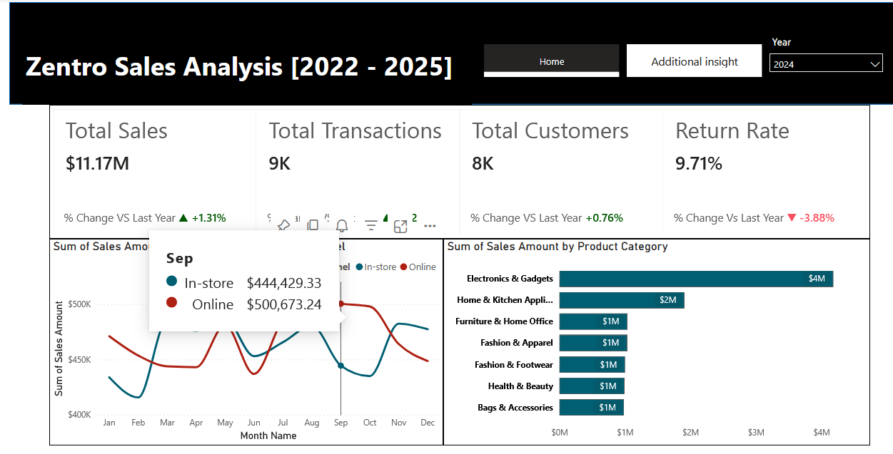
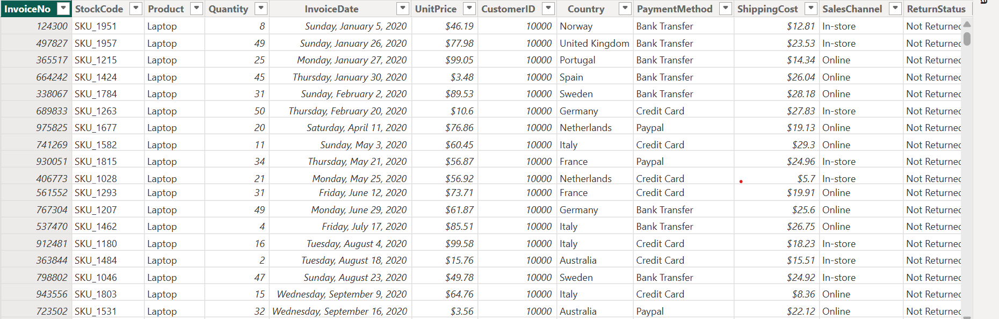

# Zentro Sales Performance Report (2020–2025)
Analyzing 5 years of transaction data to optimize retail operations and reduce return rates using Power BI.

## Executive Summary
- Zentro management lacked visibility into transaction-level data, struggling to track performance across regions and product categories over a 5-year period.
- Developed an interactive Power BI dashboard consolidating 49,000+ transactions to track KPIs, sales trends, and customer behavior.
- Delivered a centralized, data-driven reporting solution enabling stakeholders to track over $63M in sales, identify a 7.8% return-rate spike in 2023, and validate post-2023 policies. The analysis highlighted Electronics & Gadgets as the top revenue driver, balanced payment behavior, and the UK as a key growth market, guiding targeted marketing and regional strategy.

##  The Business Problem
Zentro required a data-driven approach to understand their sales performance from January 2020 to September 2025. The stakeholders' primary objective was to move away from static reporting to a dynamic view that could support informed business decisions.

## Key Questions Addressed:
- How have Key Performance Indicators (KPIs) changed YoY?
- Which product categories and regions are lagging?
- What are the preferred customer payment channels?

## The Process (Methodology)
### Tools Used:
Power BI, Power Query, DAX

### Data Sourcing & Overview
The dataset consists of approximately 49,000 transactions with 16 columns, covering operations across all current locations.

### Data Cleaning & Transformation (ETL)
Using Power Query, the raw data was transformed to ensure accuracy:
- Removed duplicate entries from the dataset.
- Corrected Product Category naming conventions and standardized Payment Method (e.g., renamed paypall to PayPal).
- Created a new SalesAmount calculated column.
  
### Data Preview

## Analysis & Insights
This section breaks down the data into actionable stories.

###  Sales Growth & KPI Trends
- Total sales exceeded $63M during the review period, with an average of $11M annually.
- Sales showed a slight decline of 0.92% in 2022 compared to 2021, but recovered in subsequent years.
- A significant finding was the return rate spike in 2023 (+7.8%).
- 
### Product Category Performance
- Electronics & gadgets is the dominant category, totalling $3M in 2025 and exceeding the next closest category (Home & Kitchen Appliance) by $2M.
 
### Customer Behavior & Demographics
- Customer preference is split almost perfectly in thirds: Credit Card (33%), Bank Transfer (33%), and PayPal (34%). This indicates a need to maintain robust support for all three gateways.
- The United Kingdom is the highest contributor to sales, generating approximately $1.3M in total revenue. All other countries contribute similar amounts, with total sales ranging between $575,000 and $700,000.

## Recommendations
Based on the data analysis, I recommend the following actions for Zentro:
- The policies introduced in 2024 have successfully curbed the return rate spike observed in 2023 and should be standardized across all regions.
- Lessons should be drawn from the strong performance of the Electronics and Gadgets categories, as their success can be replicated across other product categories.
- Given that the United Kingdom contributes a significantly higher share of total sales, marketing efforts should be increased to strengthen and maintain market dominance in the country.
- Additionally, strategies driving sales success in the UK should be adapted and applied across other operating countries to ensure more balanced sales performance globally.

## Links
[Interactive Power BI Dashboard](https://app.powerbi.com/view?
r=eyJrIjoiMGZmZDdhYjctNTQ3Yy00YTUzLWE4NGYtOTRkY2Q4YmJhMGZlIiwidCI6IjVjNzI1OWEyLTg1YjAtNDIzZC1hNWM5LTE3ZjFmN2Y2Y2ZjNCJ9)

